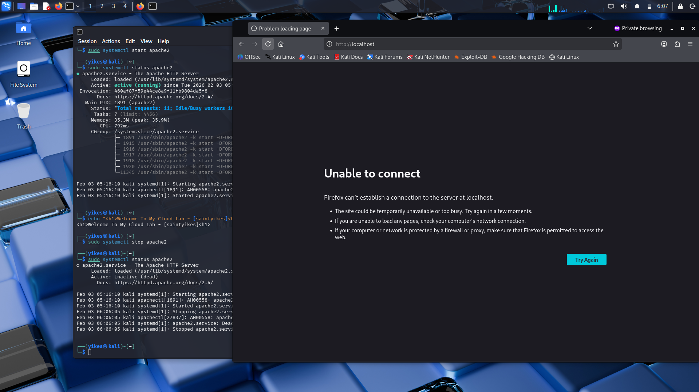
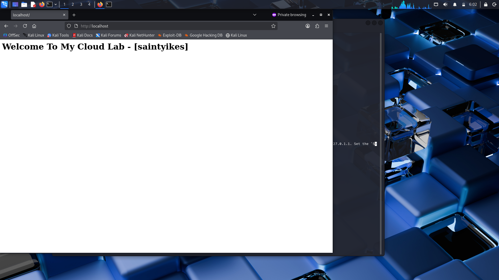

# Project 1: Cloud Support Lab: Web Server Troubleshooting

This project showcases hands-on experience in managing a Linux web server, simulating a real-world Cloud Support ticket. The lab demonstrates the use of core Linux CLI tools to deploy, monitor, diagnose, and recover a crashed web service.

## Skills Demonstrated
*   Linux CLI: 'systemctl', 'apt', 'rm', 'mv', 'curl', 'echo', 'tee', 'ls', 'df -h', 'top', 'tail -f'
*   Web Services: Apache2 management (deployment, monitoring, configuration)
*   Troubleshooting: Incident management, outage verification, service recovery, browser cache resolution
*   Content Management: Modifying a web server's root index file for verification

## Incident Report: Apache2 Service Outage & Recovery

### Phase 1: Service Verified (The "Green Light")

The service was verified as active (running) via systemctl, proving the web server was operational.

### Phase 2: Simulating Outage & User Impact

The service was stopped (systemctl stop) to simulate an outage, and the user experience (browser connection error) was verified.

### Phase 3: Recovery & Final Verification

The service was restored, and the default page was replaced with a custom message using echo and tee to confirm full administrative control and successful content deployment.

## Project 2: AWS Cloud Migration & Security

In this project, I migrated the web server to the AWS Cloud to practice infrastructure provisioning and network security.

### 1. Remote Cloud Verification (The "First Login")
Action: After connecting via SSH from my Kali Linux terminal, I performed an identity and health check on the remote AWS server.
* Commands: 'whoami' (verified the ubuntu user), 'hostname' (identified the internal AWS node), and 'uptime' (confirmed the server's running time in the data center).

### 2. Apache2 Service Management
Action: I installed the Apache web server on the Ubuntu instance and verified its operational status.
* Insight: Used 'systemctl status apache2' to confirm the service was active (running), proving the web engine was healthy.
-Status.png)

### 3. Simulating a Service Outage (Troubleshooting)
Action: To practice diagnosing a "Service Down" ticket, I manually stopped the web server using 'sudo systemctl stop apache2'.
* The Result: The browser returned an "Unable to Connect" error. This confirmed the network path was open, but the application itself was unresponsive.
-Connection-Error.png)

### 4. Custom Web Deployment
Action: I modified the server's index file to display a custom message, verifying successful content delivery over Port 80 (HTTP).
-Custom-Message.png)

### 5. Security Group Configuration (The "Bouncer")
Action: Configured the AWS Security Group using the "Principle of Least Privilege."
* SSH (Port 22): Restricted to My IP only to prevent unauthorized remote access.
* HTTP (Port 80): Open to Anywhere (0.0.0.0/0) to allow public web access.
* HTTPS (Port 443): Open to Anywhere (0.0.0.0/0) to allow public web access
-Security-Config.png)
