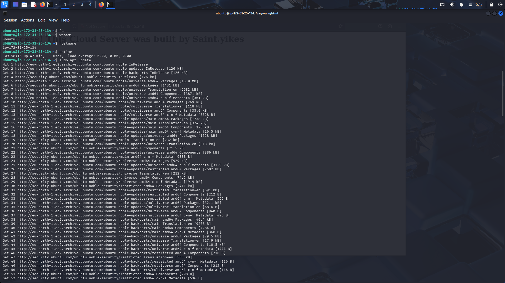

# 🛡️ AWS Infrastructure: Web Server Migration & Security Hardening

### 📌 Executive Summary
This project demonstrates a successful Rehost (Lift and Shift) migration of a Linux-based web server to the AWS Cloud. The focus was on infrastructure provisioning, implementing the Principle of Least Privilege via Security Groups, and performing end-to-end service validation.

---

### 🛠️ Technical Competencies Demonstrated

*   Cloud Provisioning: Deployment and configuration of Amazon EC2 (Ubuntu 22.04 LTS).
*   Infrastructure Security: Orchestrated ingress/egress rules via AWS Security Groups to minimize the attack surface.
*   Remote Administration: Established secure, encrypted management tunnels using SSH (RSA Key-Pairs).
*   System Observability: Utilized 'systemctl', 'whoami', and 'uptime' for remote environment auditing.

---

### 🚀 Implementation & Triage Workflow

#### 1. Remote Instance Validation (The "Post-Migration" Audit)
Upon successful deployment, an immediate audit was performed to verify the integrity of the remote environment and current user context.
*   Action: Executed 'whoami', 'hostname', and 'uptime' to confirm stable operation within the AWS data center.
*   Evidence: 

#### 2. Service Orchestration: Apache2 Deployment
The web engine was installed and audited to ensure service availability.
*   Action: Verified daemon status via systemctl status apache2 to confirm an active (running) state.
*   Evidence: -Status.png)

#### 3. Incident Simulation & Network Triage
To test diagnostic capabilities, a "Service Down" event was simulated to verify the separation between the Network Path and the Application Layer.
*   Observation: Manually stopping the service resulted in a browser-side "Connection Refused" error, confirming that while the Security Group allowed traffic, the application was unresponsive.
*   Evidence: -Connection-Error.png)

#### 4. Custom Web Deployment & HTTP Verification
Final validation involved deploying custom content to ensure full administrative control over the web root.
*   Evidence: -Custom-Message.png)

#### 5. Network Security Hardening (The "Bouncer" Config)
Implemented a high-security posture by strictly limiting ingress traffic based on the Principle of Least Privilege.
*   SSH (Port 22): Locked to Authorized Administrative IP only to prevent brute-force attacks.
*   HTTP/S (80/443): Enabled for public ingress to facilitate global web traffic.
*   Evidence: -Security-Config.png)

---
Status: Cloud Infrastructure Hardened & Verified. 🟢
