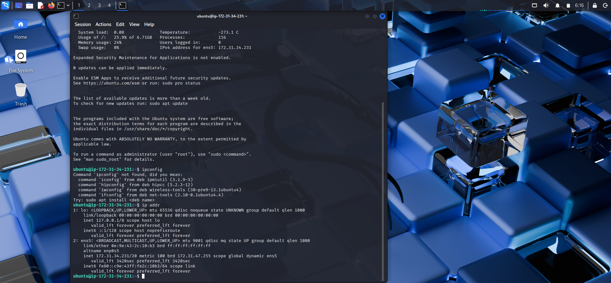
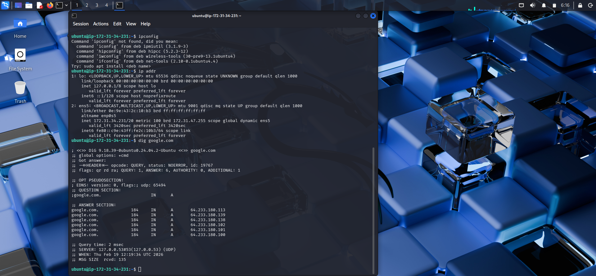
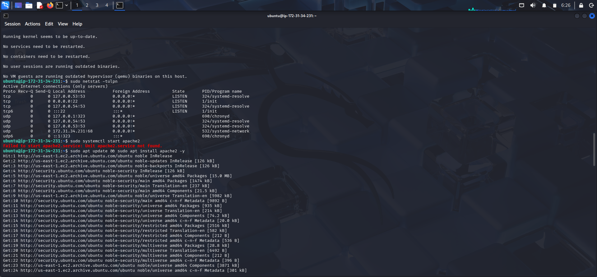

# 🌐 Network Triage & Connectivity Diagnostics

### 📌 Project Overview
This project demonstrates advanced proficiency in Network Layer Triage on a live AWS EC2 instance. I performed an end-to-end audit of the server's network stack to verify DNS integrity, IP configuration, and Service-Port binding.

---

### 🛠️ Diagnostic Toolkit
*   Layer 3 (Network): 'ip addr', ping (ICMP reachability)
*   Layer 4 (Transport): 'netstat -tulpn', ss (Port state monitoring)
*   Layer 7 (Application): 'dig', 'nslookup' (External domain resolution)

---

### 🚀 Technical Implementation & Proof of Work

#### 1. Interface & IP Address Auditing
Verified the internal network interface configuration to ensure stable communication within the VPC subnet.
*   Command: 'ip addr'
*   Evidence: 

#### 2. DNS Integrity & Resolution Verification
Validated the server's ability to resolve external domains, confirming that the VPC Resolver (Route53) is correctly processing requests.
*   Command: 'dig google.com'
*   Evidence: 

#### 3. Active Port & Service Listening State
Audited the transport layer to confirm that all required daemons are correctly bound to their designated ports.
*   Command: 'sudo netstat -tulpn'
*   Validation: Verified that Port 22 (SSH) and Port 80 (Apache2) are in the LISTEN state.
*   Evidence: 

---

### 🔧 Real-World Troubleshooting: Missing Service Unit
The Incident: Initialized a service status check which returned a Unit apache2.service not found error.

Evidence of Error: 

The Resolution: 
1. Diagnosis: Identified a missing Apache2 binary in the local system path.
2. Action: Executed a system-wide update and deployed the missing package via 'sudo apt update && sudo apt install apache2 -y'.
3. Verification: Performed a post-installation port audit to confirm Port 80 was active and accessible.
