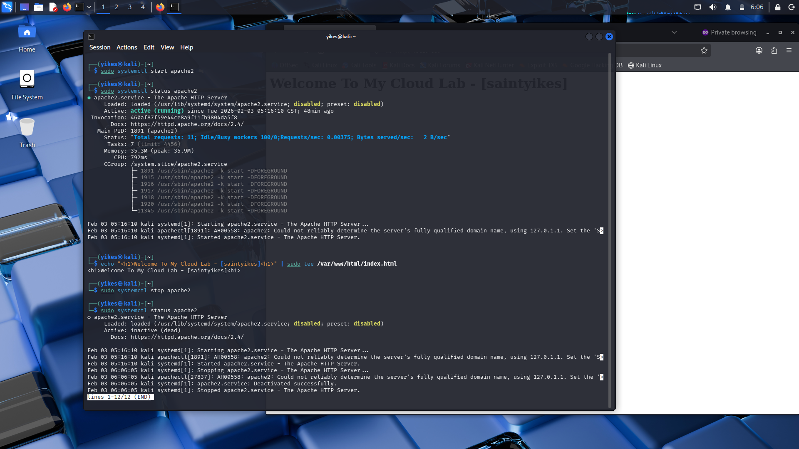

# Cloud Support Lab: Web Server Troubleshooting

This project showcases hands-on experience in managing a Linux web server, simulating a real-world Cloud Support ticket. The lab demonstrates the use of core Linux CLI tools to deploy, monitor, diagnose, and recover a crashed web service.

## Skills Demonstrated
*   Linux CLI: 'systemctl', 'apt', 'rm', 'mv', 'curl', 'echo', 'tee', 'ls', 'df -h', 'top', 'tail -f'
*   Web Services: Apache2 management (deployment, monitoring, configuration)
*   Troubleshooting: Incident management, outage verification, service recovery, browser cache resolution
*   Content Management: Modifying a web server's root index file for verification

## Incident Report: Apache2 Service Outage & Recovery

### Phase 1: Service Verified (The "Green Light")

The service was verified as active (running) via systemctl, proving the web server was operational.

### Phase 2: Simulating Outage & User Impact

The service was stopped (systemctl stop) to simulate an outage, and the user experience (browser connection error) was verified.

### Phase 3: Recovery & Final Verification

The service was restored, and the default page was replaced with a custom message using echo and tee to confirm full administrative control and successful content deployment.
